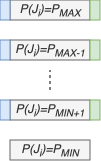
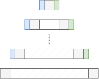

# FP STACK, Hard Floats made EASY

Stack optimization for the Cortex-M family of hard float supported devices.

## Nested Vectored Interrupt Controller

The Cortex-M Nested Vectored Interrupt Controller (NVIC) supports fixed priority preemptive scheduling among interrupt handlers. To minimize latency and CPU load, caller saved registers are stacked by the hardware on interrupt entry, and de-stacked on interrupt exit. The hardware stacking operation is by itself preemptive, allowing constant time interrupt dispatch. Additionally, tail-chaining reduces the cost for cases where stacking would immediate follow a de-stacking operation. The overhead (assuming no wait-state free memory access) is 12 cycles for entry/exit respectively, which allows for best-in class performance among COTS micro-controllers. The design allows interrupt handlers to be implemented as ordinary functions, without need for special code-gen/interrupt attributes etc.

## Cortex M Hard Floats

Cores supporting hardware accelerated floating point instructions, have 32 additional 32 bit registers (S0-31), optionally configured as 16-64 bit registers (S0, S1)-(S30, S31).

The Cortex-MF architecture provides hardware support for stacking these 32 registers on interrupt entry (and de-stacking on exit). However, enabling this feature implies a high entry/exit cost due to the high number of floating point registers. It also implies a stack size growth accordingly.

To mitigate the high overhead, the Cortex-MF architecture introduces the concept of lazy-stacking. Essentially on execution of a floating point operation, it checks if stacking is necessary, and takes the stacking cost on first use (on handler return-the floating point registers are de-stacked in case of stacking.).

This allows the best-in class interrupt characteristics to be maintained by default, while taking the additional cost lazily when needed.

While this approach may appear advantageous in comparison to the always stack option, it comes with a major drawback of predictability. 

From a scheduling analysis point of view, we may only assume the worst case unless modelling/analyzing the complete set of interrupt handlers regarding their use of floating point registers.

And in the case of such modelling and analysis, is lazy-stacking really the best we can do?

In this work, we will make a deep dive into code analysis based on symbolic execution of RTIC task/resource models, and show that we can obtain:

- Fully predictable stacking overhead
- Minimal memory and CPU load

## Interrupt Model

Assume a set of tasks (or jobs) $J_1$..$J_n$, with $P(J_i)$ indicating the static priority of $J_i$. In the below figure, blue/green indicates entry and exit of corresponding implementations (Rust functions in our case). The lowest priority job(s) are implemented as single non returning function (allowing entry/exit code may be optimized out). Jobs at lowest priority level may execute asynchronously, using cooperative multi-tasking (Rust async). 

For preemptive execution we can bind each job to an interrupt vector, with interrupt priority set according to the static job priority.

During execution higher priority jobs may preempt lower jobs running with lower priority as shown in the figure below.

A hatched region indicate that job is in a preempted state. The lowest priority jobs execute in thread mode while higher priority jobs execute in handler mode on a shared stack. Stack sharing between handler and thread mode is optional.

## RTIC framework

The RTIC framework provides a declarative model for real-time tasks with shared resources. In this work we focus on hard real-time systems, scheduled for single-core execution under the Stack Resource Policy. For the discussion, we assume static priority based scheduling and along with single-unit resources (as implemented by RTIC-v1), but our results straightforwardly generalize to multi-core, dynamic priorities, multi-unit (readers-writer lock) adoptions, as our findings does not rely on model restrictions implied by RTIC-v1.

## The EASY tool

The Execution Analysis by SYmbolic execution (EASY) tool, performs exhaustive path exploration of RTIC v1 models by means of binary level symbolic execution. The EASY tool relies on instruction level modelling (in our case the ARM v7em with hard floats, applicable to a wide range of Cortex-M based implementations). EASY allows domain extensions, capturing code execution side effects.

In this work we leverage this to record the set of floating point registers accessed along each feasible path, reachable from each entry point for the analysis.

## Hard Floats made EASY

In order to establish a safe upper bound for stacking of floating point registers we define:

- $F(J_i)$ as the set of floating point registers accessed by $J_i$.
- $S(J_i)$ as the set of floating point registers that $J_i$ needs to stack before use.

$F(J_i)$ can be obtained by EASY analysis of $J_i$, returning the set union of registers accessed along each feasible path of $J_i$.

$S(J_i)$ can be obtained by: $$ S(J_i) = F(J_i) \cap \bigcup_{P(J_j) < P(J_i)} F(J_j)$$
 
That is we stack all registers that the current task ($J_i$) accesses being used by any lower priority task.

This is a safe upper bound. A tighter bound may be obtained by the observation that only a single job per priority level can execute at any point it time. For this presentation we adopt the safe upper bound and leave improving the bound to future work.

## Comparison to Lazy Stacking.

As already mentioned the lazy stacking proper is a poor mans solution, offering *no* advantage over the always _stack all_ strategy when it comes to worst case assumptions. To leverage the advantage of lazy stacking in a hard-real time scenario EASY based analysis will be able to successfully predict its behavior, but with the analysis at hand we can do better.

In the lazy-stacking case, we will always stack *all* or *none* of the registers, using our Hard Floats made EASY approach, we analyze the need need for stacking down to each single register.

That means we always win, or does it?

Assume that only a single register is to be stacked, we win by a margin of 31 store and load memory accesses, at the cost of one store instruction in the entry code, and one restore instruction in the exit code. Analogously, we win by a reduction to one memory store over 32 (a 97% reduction). In case all registers are to be stacked the memory requirement is trivially equivalent, while the HFE comes with the overhead of 2 extra instructions. For this special edge case, temporarily toggling to lazy stacking is possible by writing/restoring the Floating Point Context Control Register (FPCCR) register in the entry/exit code would be an alternative. However, the cost and complexity of FPCCR control out-weights potential gain.

## Experimental Evaluation

Floating point calculations in hard real-time systems introduce additional complexity (either in the hardware or by software emulation). Thus, common engineering practice is to circumvent the need for floats, by careful adoption of fixed point arithmetic counterparts.

However in cases fixed point arithmetics do not suffice or become unwieldy and cumbersome, floats are called for. Software emulation have a reputation of being notoriously slow, where depending on precision requirements single operations like square-root may imply un-acceptable overhead. The use of hard floats on the Cortex MF architecture however comes with either a very high interrupt cost (always _stack all_), or limited predictability (leading to a worst case _stack all_ assumption).

To the remedy our solution HFE, solves both problems and implement fully predictable and provably safe software stacking.

As an industrially relevant use case, we have developed a measurement sub-system of a commercial load balancer for Electrical Vehicle (EV) charging. In a high priority task $(A)$, we collect 12-streams of 12-bit ADC measurements, interpolated to 16 bit signed integer resolution, and for each data point (50kHz) perform a set of filtering calculations.

Lower priority task $(B)$ with a 1ms periodicity we calculate RMS, and identify critical fault modes, and at lowest priority for the set of measurement tasks, we communicate aggregated values to the over-arching system at 1Hz $(C)$.

Concurrently the embedded system manages other tasks at different priorities lower than $(A)$ and $(B)$. While not directly interfering with the timing critical tasks, their contributions and use of common shared resources affects the static priority SRP based scheduling, and thus are taken into account for the analysis.

### Baseline Lazy Stacking

Todo Measure worst case stacking cost, use stock EASY to determine response time/schedulability for the worst case assumption.

### Hard Floats mode EASY

Todo Table of used floats in each task, manual entry exit code for POC implementation. Calculate tight response time/schedulability test for the POC.

Show that we have good margin to deadlines.

## Conclusions

In this paper we have scrutinized the stacking impact of adopting ARM Cortex MF hardware floating point operations in preemptively executing hard real-time systems. We found to main issues with the ARM defined lazy stacking.

- An all or nothing approach, leading to high CPU and memory overhead, which may hinder use in hard real-time context, and
- Lack in predictability, leading to worst case assumptions on the stacking behavior.

In this paper we propose, Hard Floats made EASY (HFE), to address the aforementioned problems, without changing the hardware implementation. 

We take the outset of the declarative task-resource model of the RTIC applications, and adopt and enhance the EASY tool to extract the necessary information to determine the per-task stacking requirements. Instead of the hardware implemented lazy stacking, we inject SW based stacking for each task, to protect the floating point registers according to the derived requirements to ensure race-free execution.

We have shown that HFE reduces the stacking overhead by up to 97% in comparison to the ARM provided lazy stacking, while the worst case performance is on par with existing solutions.

The feasibility of the approach has been demonstrated in an industrial use case, for which we observe a 93% reduction of stacking overhead.

In future work, we project to explore the potential to further tighten the (safe) bound. The problem falls into the category of NP hard cover problems (for this case exploring the set of possible preemption patters). For larger task sets, brute force exploration may prove computationally intractable, thus techniques like genetic algorithms/heuristics may be plausible.

Another opportunity is to explore preemption aware floating point assignment in the compiler backend. The observant reader might already have drawn the conclusion that minimizing register set intersection between tasks at different priority should be beneficial. Conversely, for tasks operating at same static priority register-set difference should be detrimental in the general case. By these observations, backed-code generation may reduce the set of registers that needs stacking.

